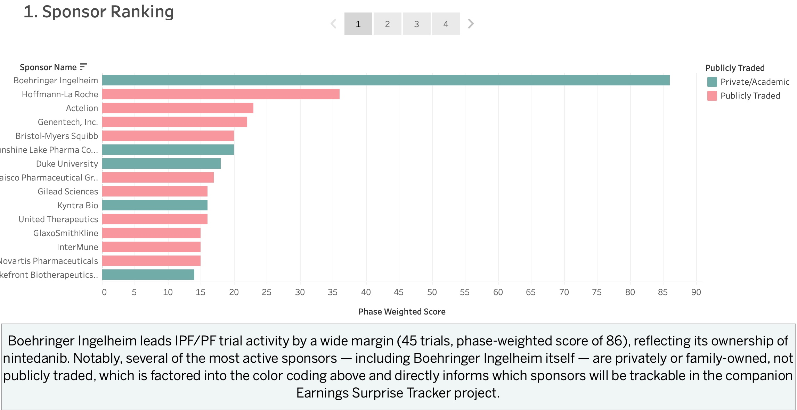
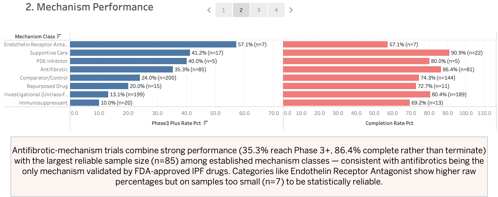
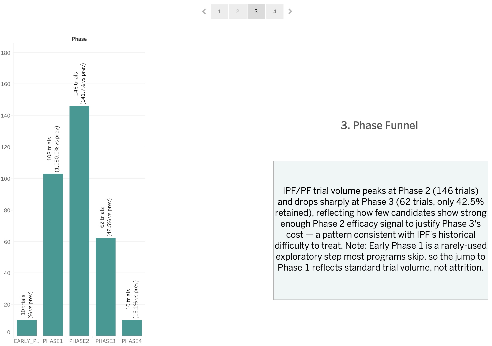
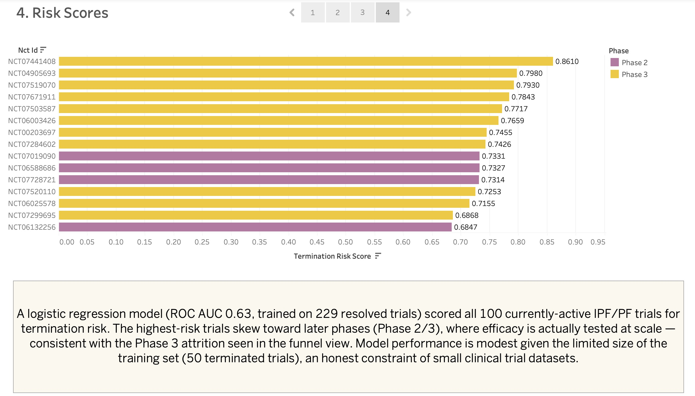

# IPF/PF Clinical Trial Intelligence Database

An end-to-end data pipeline and analytics project examining idiopathic pulmonary fibrosis (IPF) and pulmonary fibrosis (PF) clinical trials — built to answer one question: **does the science on IPF match what drug developers are actually betting on?**

**[View the live Tableau dashboard →](https://public.tableau.com/app/profile/chase.patterson8613/viz/IPF_PF_Trial_Intelligence_Dashboard/IPFPFTrialStories)**

---

## Why this project

I spent time in corporate development and finance at a biopharma company working on IPF/PF therapeutics, doing deal benchmarking, vendor spend analysis, and stakeholder reporting. This project applies that domain background to a public dataset — pulling every registered IPF/PF trial, enriching it with FDA outcomes, and using SQL and machine learning to test whether trial activity, mechanism strategy, and drug development risk line up with what's actually known about the disease.

## What it does

1. **Ingests** ~575 IPF/PF clinical trials from the [ClinicalTrials.gov v2 API](https://clinicaltrials.gov/data-api/api-gateway), filtering out false-positive matches (e.g. cystic fibrosis) that simple keyword search picks up
2. **Enriches** trial data with FDA approval outcomes from [openFDA](https://open.fda.gov/), matching investigational and approved drugs by name
3. **Classifies** every drug intervention by mechanism class (antifibrotic, immunosuppressant, endothelin receptor antagonist, etc.) using verified pharmacology
4. **Analyzes** the data with four SQL queries covering sponsor competitive ranking, phase funnel attrition, mechanism-based success rates, and duration benchmarks — built with CTEs, window functions, and percentile aggregations
5. **Predicts** trial termination risk for currently-active trials using a logistic regression model
6. **Visualizes** all of it in an interactive Tableau Public story

## Key finding

**Antifibrotic-mechanism trials outperform on both scale and outcome.** With 85 trials — the largest reliable sample among established mechanism classes — antifibrotic trials show a 35.3% Phase 3+ progression rate and an 86.4% completion rate, tracking closely with the fact that antifibrotics are the only mechanism class validated by FDA-approved IPF drugs (pirfenidone, nintedanib). Immunosuppressant approaches, by contrast, show the longest median trial duration (1,370 days) and the lowest completion rate (69.2%) — consistent with IPF being a primarily fibrotic, not inflammatory, disease. The logistic regression risk model independently corroborates this: later-phase trials carry higher predicted termination risk, echoing a sharp drop-off in trial volume between Phase 2 and Phase 3 in the funnel analysis.

Three independent analyses — SQL success rates, duration benchmarks, and a risk model — all converge on the same story.

## Tech stack

| Layer | Tools |
|---|---|
| Ingestion | Python (`requests`, `pandas`, `psycopg2`) |
| Database | PostgreSQL (Docker), normalized 5-table relational schema |
| Analysis | SQL — CTEs, window functions (`RANK`, `DENSE_RANK`, `LAG`), `PERCENTILE_CONT` |
| Machine Learning | scikit-learn — logistic regression, `ColumnTransformer`/`Pipeline`, balanced class weights |
| Visualization | Tableau Public |

## Database schema

- `sponsors` — trial sponsors, including a `publicly_traded` flag and ticker symbol bridging to a companion earnings-tracking project
- `trials` — core trial data (phase, status, dates, enrollment)
- `interventions` — drugs/devices tested, tagged with `mechanism_class`
- `fda_outcomes` — FDA approval status matched by drug name, keyed to avoid cross-contamination when a trial tests multiple drugs
- `trial_risk_scores` — model-predicted termination risk for active trials

## Dashboard preview

**Sponsor Competitive Ranking**

**Mechanism Class Performance**

**Phase Funnel Attrition**

**Active Trial Risk Scores**

*(Static previews above — [click through the live, interactive version here](https://public.tableau.com/app/profile/chase.patterson8613/viz/IPF_PF_Trial_Intelligence_Dashboard/IPFPFTrialStories).)*

## Known limitations

Being upfront about the constraints of this project:

- **~55% of drug interventions remain mechanism-unclassified.** Early-stage investigational compounds frequently lack published mechanism data. Everything I could verify (through pharmacology knowledge and targeted research) is tagged; the rest is honestly labeled `investigational_unclassified` rather than guessed.
- **FDA outcome matching is name-based and approximate.** Drug naming is inconsistent across trial registries and regulatory filings, so some legitimate matches are likely missed.
- **"Attrition" reflects cross-sectional trial counts, not longitudinal drug tracking.** ClinicalTrials.gov registers each phase as an independent trial entry rather than following one drug through its full lifecycle, so the funnel shows where trial *activity* concentrates, not a single asset's path through development.
- **The risk model's ROC AUC (0.63) is modest**, reflecting a small training set (229 resolved trials, only 50 terminated). This is a realistic constraint of working with a niche disease area's public trial data, not a modeling shortcut.

## Companion project: Biopharma Earnings Surprise Tracker

Project 1 was deliberately built to feed a second project. The `sponsors` table includes a `publicly_traded` flag and ticker symbol precisely so it can join against public market data — allowing the two projects to share sponsors, trial milestones, and mechanism classifications rather than duplicating that work.

The Earnings Surprise Tracker pulls stock price and earnings data (via `yfinance` and SEC EDGAR) for the publicly-traded sponsors identified here, and lines it up against this database's trial phase transitions and FDA outcomes. The goal is to extend this project's central question — does trial activity reflect the real biology of IPF? — into the market: **does Wall Street's reaction to these companies' earnings and stock moves actually track the clinical signal in their pipelines, or does the market misprice IPF-focused biotech relative to what the trial data shows?**

*(In progress — link will be added here once published.)*

## Repository structure
