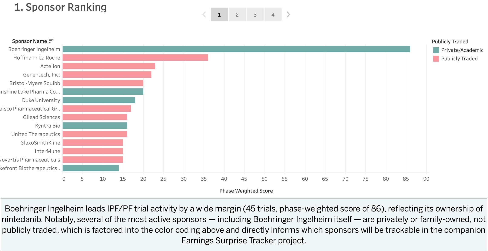
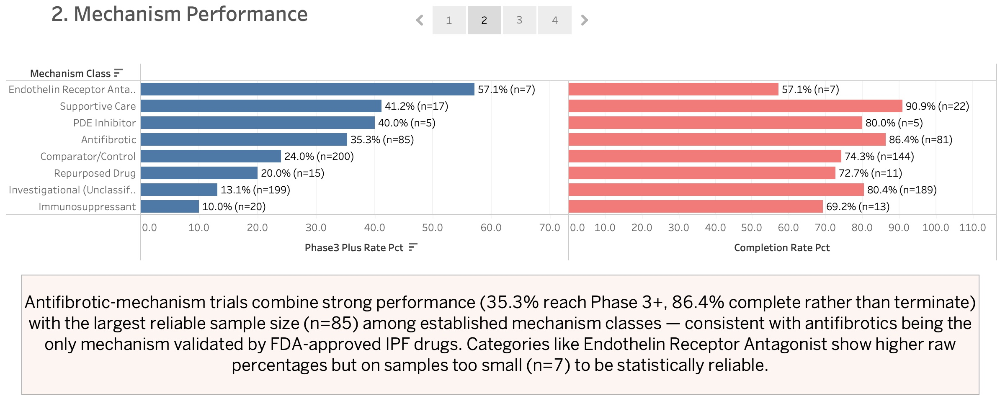
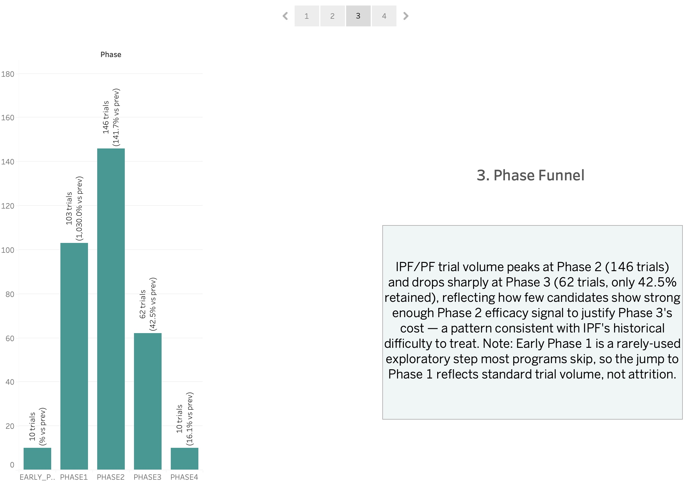
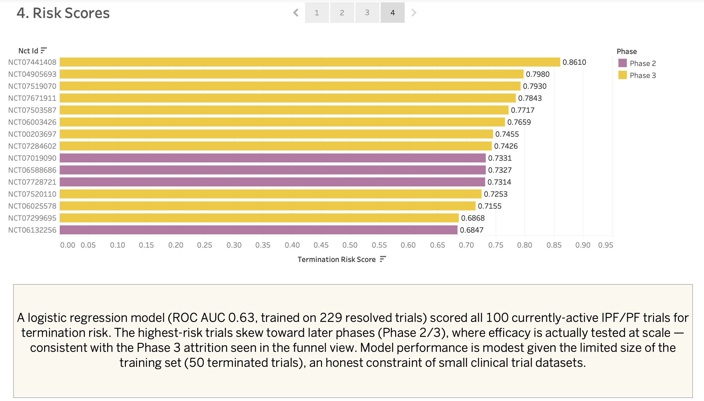

# IPF/PF Clinical Trial Intelligence Database

An end-to-end data pipeline and analytics project on idiopathic pulmonary fibrosis (IPF) and pulmonary fibrosis (PF) clinical trials, built around one question: **does the science on IPF match what drug developers are actually betting on?**

**[View the live Tableau dashboard →](https://public.tableau.com/app/profile/chase.patterson8613/viz/IPF_PF_Trial_Intelligence_Dashboard/IPFPFTrialStories)**

---

## Why this project

I spent time in corporate development and finance at a biopharma company focused on IPF/PF therapeutics, doing deal benchmarking, vendor spend analysis, and stakeholder reporting. This project applies that domain background to public data only. It pulls every registered IPF/PF trial, adds FDA approval outcomes, and uses SQL and a baseline machine learning model to test whether trial activity, drug mechanism, and development risk line up with what's known about the disease.

## What it does

1. **Ingests** 575 IPF/PF trials from the [ClinicalTrials.gov v2 API](https://clinicaltrials.gov/data-api/api), searching "idiopathic pulmonary fibrosis" and "pulmonary fibrosis" and filtering out false positives such as cystic fibrosis.
2. **Enriches** trials with FDA approval outcomes from [openFDA](https://open.fda.gov/), matching drugs by exact normalized name.
3. **Classifies** all 912 interventions by mechanism class (antifibrotic, immunosuppressant, endothelin receptor antagonist, etc.) using a hand-built pharmacology dictionary. Anything that can't be verified is labeled `investigational_unclassified` rather than guessed.
4. **Analyzes** the data with four SQL analyses: sponsor ranking, phase funnel, success rates by mechanism, and duration benchmarks. These use CTEs, window functions, and percentiles.
5. **Predicts** termination risk for active trials with a baseline logistic regression model.
6. **Visualizes** the results in a four-view Tableau Public story.

## Key findings

**Antifibrotic trials combine a strong completion rate with the largest reliable sample among established mechanism classes.**

| Mechanism class | Trials with a phase | Reached Phase 3+ | Completion rate |
| --- | --- | --- | --- |
| Antifibrotic | 85 | 35.3% | 86.4% (70 of 81) |
| Immunosuppressant | 20 | 10.0% | 69.2% (9 of 13) |
| Supportive care | 17 | 41.2% | 90.9% (20 of 22) |
| Endothelin receptor antagonist | 7 | 57.1% | 57.1% (4 of 7) |

*Completion rate = completed ÷ finished trials (completed, terminated, or withdrawn) with both a start and end date. Trials still running are excluded because they haven't had a chance to succeed or fail. A trial testing drugs from two classes counts in both.*

- The antifibrotic result tracks with the fact that the established approved IPF drugs, pirfenidone and nintedanib, are antifibrotics. This is a correlation, not proof that mechanism causes completion: phase mix, sponsor size, and trial design also differ between groups.
- Immunosuppressant trials also ran longest, with a median of 1,370 days from start to finish.
- The immunosuppressant group is small (13 finished trials, so one trial moves the rate about 8 points) and mixed, including rituximab, anti-IL-13 antibodies, and an anti-VEGF drug.
- Supportive care has a higher completion rate and endothelin receptor antagonists a higher Phase 3+ rate, but both on samples too small to rely on.

**Trial activity drops sharply after Phase 2.** Phased trial counts are 10 (Early Phase 1), 103 (Phase 1), 146 (Phase 2), 62 (Phase 3), and 10 (Phase 4). Phase 3 volume is 42.5% of Phase 2. This is a cross-sectional count of trials per phase, not one drug's path through development (see limitations).

**Boehringer Ingelheim dominates IPF/PF trial activity** with 45 trials and a phase-weighted score of 86, consistent with its ownership of nintedanib. Several of the most active sponsors, including Boehringer Ingelheim, are privately or family-owned.

## How the data was cleaned

Matching trial drugs to FDA approvals turned up three silent bugs. None caused an error; each just produced wrong links.

- **Blank names matched everything.** Some intervention names were only a dose or punctuation. After cleaning they became empty strings, which match anything. Fix: skip names under four characters, and skip placebo, vehicle, control, and similar non-drug entries.
- **Join contamination.** FDA results were originally linked to trials by trial ID alone, so in a trial testing two drugs, both drugs appeared to share the same FDA outcome. Fix: store `matched_drug_name` with each outcome so every approval attaches to the right drug in the right trial.
- **Wrong approval date.** One drug can have several FDA applications, such as the original brand approval and later generics. Fix: require an exact name match and keep the earliest approval date, which is the original.

## Termination risk model

A logistic regression predicts whether a trial ends without completing.

- **Inputs (6):** phase, mechanism class, sponsor class (industry, NIH, other), enrollment count, trial length (start to primary completion, in days), and whether the sponsor is publicly traded.
- **Training data:** 229 finished trials with a defined phase, 50 of which did not complete (terminated or withdrawn). The data was split 80/20 for training and testing, with balanced class weights so the model doesn't simply predict "completes" every time.
- **Preprocessing:** a scikit-learn `Pipeline` with a `ColumnTransformer` (one-hot encoding for categories, scaling for numbers), so training data and active trials are prepared identically.
- **Performance:** ROC AUC of 0.63 on the held-out ~46 trials. That's better than chance (0.5), but modest, and noisy given the small test set.
- **Output:** 100 active trials scored and written back to `trial_risk_scores`. Higher-scoring trials skew toward Phase 2 and 3. Because classes are balanced, scores are best read as a **ranking**, not as true probabilities. A score of 0.86 means "highest on the list," not "86% chance."

## Tech stack

| Layer | Tools |
| --- | --- |
| Ingestion | Python (`requests`, `pandas`, `psycopg2`) |
| Database | PostgreSQL in Docker, normalized 5-table schema |
| Analysis | SQL: CTEs, window functions (`RANK`, `DENSE_RANK`, `LAG`), `PERCENTILE_CONT` |
| Machine learning | scikit-learn: logistic regression, `Pipeline`/`ColumnTransformer`, balanced class weights |
| Visualization | Tableau Public (built from CSV exports, since Tableau Public can't connect to a local database) |

## Database schema

- `sponsors`: trial sponsors, with a `publicly_traded` flag and `ticker_symbol` that bridge to the companion event study. Acquired companies are mapped to their current public parent (e.g., Genentech → Roche).
- `trials`: core trial data (phase, status, dates, enrollment, reason stopped).
- `interventions`: drugs, biologics, devices, and procedures tested, each tagged with `mechanism_class`.
- `fda_outcomes`: FDA approval status and earliest approval date, keyed by trial and `matched_drug_name`.
- `trial_risk_scores`: model scores for active trials, with model version and timestamp.

## Dashboard preview

**1. Sponsor Ranking**


**2. Mechanism Performance**


**3. Phase Funnel**


**4. Risk Scores**


*(Static previews. [Explore the live interactive version here](https://public.tableau.com/app/profile/chase.patterson8613/viz/IPF_PF_Trial_Intelligence_Dashboard/IPFPFTrialStories).)*

## Known limitations

- **46% of interventions are unclassified (423 of 912).** Of those, 263 are drugs or biologics with no verifiable public mechanism data (often just a compound code). The other 160 are devices, procedures, or programs that have no drug mechanism. Another 223 interventions are placebos or controls.
- **FDA matching is name-based and exact.** Drug naming is inconsistent across registries and filings, so some real matches are missed.
- **The phase funnel is cross-sectional.** ClinicalTrials.gov registers each phase as a separate trial, so the funnel shows where trial activity concentrates, not one asset's path. Trials labeled with two phases (e.g., Phase 2/3) are counted under the first.
- **Only the first-listed condition is checked** when filtering for IPF/PF, so a few relevant trials may be missed.
- **The risk model has an outcome leak.** ClinicalTrials.gov replaces planned enrollment and end dates with actual values once a trial finishes. A terminated trial often ends early with few patients, and a withdrawn trial enrolls zero. So the model partly learns from information that only exists after the outcome, while active trials still show planned values. The 0.63 AUC may be optimistic. The fix is to use only values known at registration and to model withdrawn trials separately from terminated ones.
- **One mechanism class per trial in the model.** Each trial takes the class of its first-listed intervention, so a trial that lists its placebo first is tagged "comparator."
- **Sponsor ranking doesn't merge subsidiaries.** Roche, Genentech, and InterMune appear as separate sponsors.

## Companion project: IPF/PF Biopharma Trial Event Study

This project was built to feed a second one. The `publicly_traded` flag and ticker symbols in `sponsors` define the company list, and trial milestone dates from `trials` become events in the [IPF/PF Biopharma Trial Event Study](https://github.com/chasepatterson221/ipf-earnings-tracker). That project measures how sponsors' stock prices moved around 270 trial milestones across 31 tickers, extending the central question here into the market: does Wall Street's reaction track the clinical signal?

## Run it yourself

```bash
# 1. Start PostgreSQL
docker run --name ipf-postgres -e POSTGRES_DB=ipf_trial_intelligence \
  -e POSTGRES_USER=ipf_user -e POSTGRES_PASSWORD=ipf_pass -p 5432:5432 -d postgres:16

# 2. Install Python packages
pip install requests psycopg2-binary pandas scikit-learn

# 3. Create the schema
docker exec -i ipf-postgres psql -U ipf_user -d ipf_trial_intelligence < sql/01_schema.sql

# 4. Load and tag the data
python src/ingest_trials.py
python src/ingest_fda_outcomes.py
python src/tag_mechanism_class.py
docker exec -i ipf-postgres psql -U ipf_user -d ipf_trial_intelligence < sql/04_populate_publicly_traded.sql

# 5. Train the model and score active trials
python src/train_risk_model.py
```

Run the analyses in `sql/02`, `03`, `05`, and `06` the same way. The queries in `exports/` produce the CSVs the Tableau workbook is built from. Results will differ slightly from those above because ClinicalTrials.gov is updated continuously.

## Repository structure

```
├── README.md
├── sql/
│   ├── 01_schema.sql
│   ├── 02_phase_funnel.sql
│   ├── 03_sponsor_ranking.sql
│   ├── 04_populate_publicly_traded.sql
│   ├── 05_mechanism_success_rates.sql
│   └── 06_duration_benchmarks.sql
├── src/
│   ├── ingest_trials.py
│   ├── ingest_fda_outcomes.py
│   ├── tag_mechanism_class.py
│   └── train_risk_model.py
├── exports/          # SQL that exports each dashboard view to CSV
├── tableau/          # Tableau workbook (.twb)
└── images/images/    # Dashboard screenshots
```
